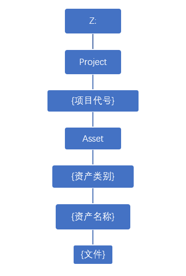

# AssetIO
TD技能学院第三期-Python基础课-期中作业
# 项目文件结构
- image(放置索引图片)
- lib（第三方包）
- script（代码）
- source（用于操作的文件）

# 作业说明
### 概述
&emsp;&emsp;你所在的公司接了一个代号为 TDC 的动画剧集项目，甲方发来的资产文件的结构以及命名规则与你们公司内部的对应规则差别很大，作为TD，你需要帮助制片编写一段脚本，将甲方发来的文件进行记录和整理，方便内部制作以及追踪。
### 功能要求
1.	将甲方发来的文件内容进行记录，方便后续回溯。
2.	将文件放到内部盘符中对应的位置。
3.	文件需按照公司内部命名规则命名。
### 规则说明
- 记录内容说明：  
    - 收到文件的时间
    - 文件的数量
    - 文件的内容
- 文件命名规则说明：
    - 文件名：{项目代号}_{资产名}_{资产类别}.ma
    - 单词首字母大写
- 内部文件夹结构说明：
    - 所有文件夹单词首字母大写
    - 以{}包围的结构表示动态名称
    - 资产类别分为：Cha（角色）、Env（场景）、Prop（道具）
    - 文件夹结构如下：  
    

### 完成条件
&emsp;&emsp;甲方文件相对凌乱，需要你自行分析其结构特点，并按照第二条所述规范完成文件的整理和记录工作即可。  
&emsp;&emsp;下方的扩展要求为选做，根据个人情况酌情完成即可。
### 扩展要求
1. 将文件打包发回，发回时需要回归为甲方原有文件结构，并以代码执行时间为压缩包名称。
2. 当资产有更新时，可以替换最新资产，并备份旧资产。